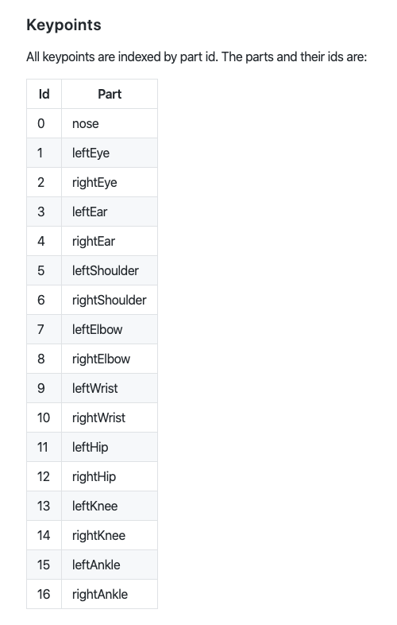

## software we need:

- Processing 3
  - OSC library
  - runwayML library

- runwayML
  - docker
  - setup posenet to run locally

## we will try:

- ~~Processing <--> OSC <--> runwayML~~

- ~~Processing <--> runwayML(OSC) <--> runwayML~~
  
- Processing <--> runwayML(http) <--> runwayML

## structure of posenet:

- poses
  - keypoints
    - (x, y) (relative to width, height [0,1])

```json
  {
  "scores": [0.393399521790664],
  "poses": [[
    [
      0.5714789077001787,
      0.4866840728062137
    ],
    [
      0.6080333462948929,
      0.40414391669665806
    ],
    [
      0.4907859540635046,
      0.40277047087130385
    ],
    [
      0.684059610974464,
      0.509903620189266
    ],
    [
      0.42625776060824266,
      0.48552613290831276
    ],
    [
      0.8382818485512344,
      0.9024627867375831
    ],
    [
      0.28463535828349196,
      0.8496557423112923
    ],
    [
      0.953369387392868,
      1.2934225356996294
    ],
    [
      0.04332311793524004,
      1.251044319297553
    ],
    [
      0.8049310246330291,
      1.3087925243006606
    ],
    [
      0.09733637390433583,
      1.112042853804414
    ],
    [
      0.6873751864822922,
      1.2128707768852147
    ],
    [
      0.31825622417583543,
      1.26854109856869
    ],
    [
      0.6895755190793643,
      1.2132942416788541
    ],
    [
      0.3211951163028465,
      1.2247794036271509
    ],
    [
      0.6944151583348731,
      1.2253813692567876
    ],
    [
      0.3362016881950171,
      1.2222375823366038
    ]
  ]]
}
```

or multi-pose: 

```json
{
  "scores": [
    0.6172202356597957,
    0.418136581484064
  ],
  "poses": [
    [
      [
        0.409379016564514,
        0.18506285467036507
      ],
      [
        0.41596413400850407,
        0.15673623660195204
      ],
      [
        0.3827366374346069,
        0.15936223263870417
      ],
      [
        0.4450671116201794,
        0.22026790069698826
      ],
      [
        0.34627014932001615,
        0.22007576199357154
      ],
      [
        0.5072894189144387,
        0.4125598302611118
      ],
      [
        0.2872323730112514,
        0.40101548542308435
      ],
      [
        0.5285479363764307,
        0.7555554005886331
      ],
      [
        0.20754289998154696,
        0.7488426253025635
      ],
      [
        0.5616021009038858,
        0.9558541630956451
      ],
      [
        0.28502920165600015,
        1.0002480007795045
      ],
      [
        0.4180030822753907,
        1.013956130246708
      ],
      [
        0.31517969402357765,
        1.0349791857055188
      ],
      [
        0.41600773213902337,
        1.257730471484856
      ],
      [
        0.28682057310171166,
        1.2863235835435327
      ],
      [
        0.4237450402998275,
        1.2611543686937268
      ],
      [
        0.30537838369955816,
        1.2746385507546512
      ]
    ],
    [
      [
        0.7759345570426971,
        0.521749245981298
      ],
      [
        0.8120587792841841,
        0.47321961454844197
      ],
      [
        0.7339601433230746,
        0.46721920336266903
      ],
      [
        0.8620715920563339,
        0.5411979178046438
      ],
      [
        0.6817837169662061,
        0.5473781392732019
      ],
      [
        0.9638598883662243,
        0.837920176843725
      ],
      [
        0.6147662888241185,
        0.8807937648973576
      ],
      [
        1.0127201896697169,
        1.0940795872461937
      ],
      [
        0.5330783569395311,
        1.2530525918136775
      ],
      [
        0.9350357422105069,
        1.28043184670029
      ],
      [
        0.6283921884655489,
        1.2819167732728596
      ],
      [
        0.8816599159389156,
        1.2790032694775773
      ],
      [
        0.6834583849526565,
        1.272072508177405
      ],
      [
        0.8818185338714244,
        1.27477340846674
      ],
      [
        0.6844708293908301,
        1.283888936506635
      ],
      [
        0.881225458842771,
        1.2363141227788963
      ],
      [
        0.6874104360198233,
        1.2436356984571726
      ]
    ]
  ]
}
```
### Index of each body parts in posenet: [more details](https://github.com/tensorflow/tfjs-models/tree/master/posenet)




## in case you updated your mac OSX and find the video library problem

(I am surprised there is no official fix). What learned from this github [issue](https://github.com/processing/processing-video/issues/134)

* a solution --> manually update the video library:

    1. Download the latest video library from the [releases page](https://github.com/processing/processing-video/releases). (I tried version 2.0-beta4 worked for me.)

    2. Unzip the folder into ~/Documents/Processing/libraries. (Remove the existing video folder if it's there)
    
    3. Open the Terminal, type cd and space then dragging in the video library folder. Then press enter. It should look like this:
        ``` bash
        cd /Users/YOUR_USER_NAME/Documents/Processing/libraries/video
        ```
    
    4. Delete the quarantine flag. Continue in terminal:
        ``` bash
        xattr -r -d com.apple.quarantine *
        ```

    5. Restart Processing.

* result: 
    1. The basic GettingStartedCapture example should work immediately. 
    2. All other examples require an extra step: specify the cameras from the Capture.list(), for instance: 
   
    ``` processing
    // old
    video = new Capture(this, 640, 480);
    ```
    
    ``` processing
    // new
    String[] cameras = Capture.list();
    video = new Capture(this, 640, 480, cameras[0]);
    ```